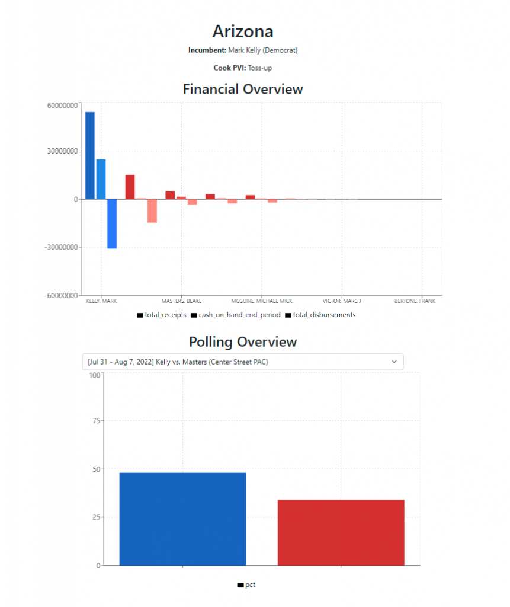
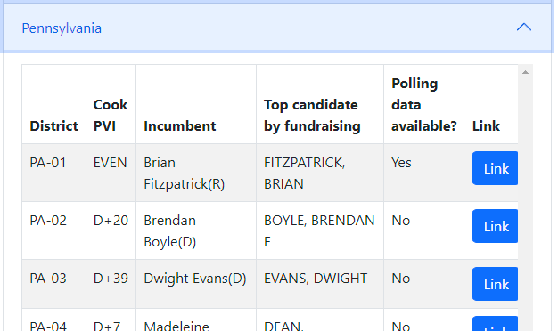

I built an election data browser that aggregates data from various sources and plots relevant information for every congressional and senate race in the country.

Every race has its own page displaying key information about the election. Atop the page is the incumbent and their party affiliation, as well as the Cook Partisan Voting Index (PVI) or Senate ranking. Below that is a financial overview, displaying leading candidate fundraising data, including their receipts (total donations received), cash on hand, and disbursements relative to the other candidates in the election. Lastly, there’s a poll browser, that displays recent polls for the race, if any are available.

## Technical Implementation
The website was built using Next.js. I programmed several Next API endpoints to handle data fetching – for example, polling data is loaded via FiveThirtyEight’s endpoints for House and Senate respectively, and FEC data is either prefetched and stored with race information or loaded directly from the FEC API. Caching was implemented to reduce load times and to be nice to the public services that are serving relatively large files for free.

Next.js handles all page routing and data prefetching easily, so the site feels quick to use despite the large amount of data it’s displaying at any given time. The individual pages also minimize the actual amount of data needed for any given view by dynamically rendering data only when it’s needed, such as when accordion menus are dropped down on the House overview page.

There are 435 house races, so it was important for performance not to load too much data all at once!
Charts were rendered using the recharts library, which provides convenient and extensible graphing abstractions.

## Credits
Courtesy to [FiveThirtyEight](https://fivethirtyeight.com/) for excellently curated and easy-to-digest polling data. Courtesy, as well, to the FEC API, which is an excellent public service and makes querying data on any election or candidate a breeze!

