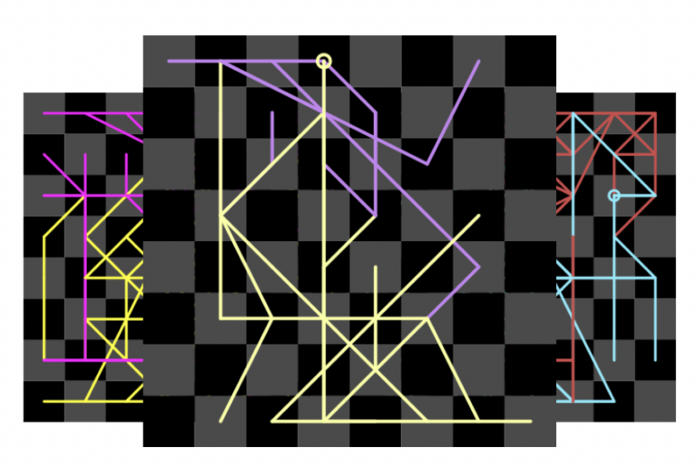

Nf6.io is an open source, full-stack web application written in React, Node.js and express.js.

The application accepts a PGN (Portable Game Notation), which is a standard output generated by most chess software (Lichess, chess.com, etc.). Nf6 then allows the user to select colors for the White pieces and Black pieces, and draws a trace of the piece movement across the board throughout the course of the game.

The result is a sometimes beautiful, often chaotic, deeply personal visualization of a game from start to finish.

Once the user is happy with their design, they may save it and receive a permanent link where that game can be found.

 page generated for the famous [Opera game](https://en.wikipedia.org/wiki/Opera_Game)](opera.png)

## Technical implementation

Using the Chess.js package, I parsed moves from the inputted PGN and generated coordinate maps. I then iterated over the pairs of from-to coordinates and traced the lines that draw out the game using the HTML Canvas API.

To save Nf6 diagrams to the server, I implemented a SQLite database and wrote custom save/lookup methods. The server generates a unique ID for each game, and writes it to the database before returning the ID to the user.

The application leverages the node-canvas package, which mirrors functionality of the standard HTML Canvas API. This allowed me to encapsulate and import the rendering logic and reuse code between the client-side and server-side.

The ability to render identical images on the server allowed me to create an /image endpoint for every game saved in the database — users can simply visit `https:\/\/nf6.io/image/\<gameid\>/\<size\>` to generate and serve a dynamically-sized version of their Nf6 image. This allows for easy embedding of Nf6 visualizations, and enabled me to use the Node package cheerio to perform server-side rendering for social media meta information so a page’s image would display on its social media share card.



## Fun Facts

I fell in love with chess during the pandemic ([like many people!](https://www.wsj.com/articles/forget-sourdough-everyone-is-playing-chess-now-11588845643)) and quickly was taken up by the creativity of the community. At one point or another, I found myself on Etsy looking for cute chess knick knacks, and stumbled upon [a store selling line-traced chess art](https://www.etsy.com/uk/shop/Immortalgames) of famous and noteworthy games. I fell in love with the concept, but not the price (frugal as I am), so I thought to myself — I could make one of those!

Nf6.io took me about a month and a half to build, start-to-finish, and represented my first “shipped” full-stack web application and my first implementation of a SQL database!

The name “Nf6” (or “Knight to f6”) refers to the [King’s Indian defense](https://en.wikipedia.org/wiki/King%27s_Indian_Defence), a common opening that was one of the first strong defenses I learned rigorously.